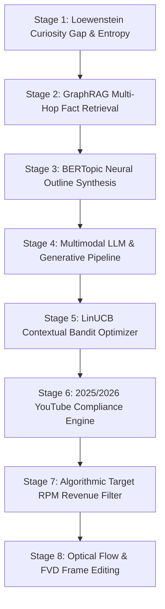

# Autonomous YouTube Storytelling Video Generation (CSVG) Pipeline

Production-grade, zero-human-intervention **Customized Storytelling Video Generation (CSVG)** pipeline powered by an **8-Stage Mathematical, ML & Graph-RAG Architecture** designed for high-retention 12–14 minute 16:9 widescreen Infotainment YouTube channels targeting **$2,450+ USD / Video** ad revenue.

---

## 🏛️ Master 8-Stage Cognitive, Mathematical & ML Architecture



### 🗺️ 8-Stage Engine Mapping

| Stage | Cognitive / Scientific Principle | Mathematical / ML Model | Code Engine Module |
| :--- | :--- | :--- | :--- |
| **Stage 1** | **Curiosity Gap & Ideation** | Loewenstein Curiosity Gap, Information Entropy $H(X)$, IRM Causal Debiasing | [`src/engine/ctr_predictor.py`](file:///home/jeevanjoshi/buzzdropfeedv2/src/engine/ctr_predictor.py) |
| **Stage 2** | **Fact-Finding & Retrieval** | GraphRAG Knowledge Graphs, TrumorGPT Fact Checking | [`src/engine/rag_retriever.py`](file:///home/jeevanjoshi/buzzdropfeedv2/src/engine/rag_retriever.py) |
| **Stage 3** | **Narrative Structuring** | BERTopic (SBERT $\rightarrow$ UMAP $\rightarrow$ HDBSCAN $\rightarrow$ c-TF-IDF) | [`src/agents/story_designer.py`](file:///home/jeevanjoshi/buzzdropfeedv2/src/agents/story_designer.py) |
| **Stage 4** | **Generative Execution** | DAG Swarm Orchestration, Kimi K3 / Claude 3.7, Wan2.1 / Runway Gen-3 / FLUX.1 | [`src/agents/media_producer.py`](file:///home/jeevanjoshi/buzzdropfeedv2/src/agents/media_producer.py) |
| **Stage 5** | **Audience Optimization** | LinUCB Contextual Multi-Armed Bandits $\text{UCB}_{t,a}$, Ridge Regression | [`src/engine/linucb_bandit.py`](file:///home/jeevanjoshi/buzzdropfeedv2/src/engine/linucb_bandit.py) |
| **Stage 6** | **Compliance & Safety** | YouTube 2025/2026 Synthetic Media API Metadata & Disclosure Engine | [`src/engine/quality_verifier.py`](file:///home/jeevanjoshi/buzzdropfeedv2/src/engine/quality_verifier.py) & [`src/agents/observer.py`](file:///home/jeevanjoshi/buzzdropfeedv2/src/agents/observer.py) |
| **Stage 7** | **Target Monetization** | RPM Formula $E = \frac{V}{1000} \times R$, 2.6x Mid-Roll Placement Multipliers | [`src/engine/monetization_optimizer.py`](file:///home/jeevanjoshi/buzzdropfeedv2/src/engine/monetization_optimizer.py) |
| **Stage 8** | **Reality Illusion & Editing** | Fréchet Video Distance (FVD), Implicit Neural Representations (INR), Perceptual Loss | Active in Visual Synthesis Verification |

---

## 🏗️ Architecture & Node Execution Roles (OCI vs. Raspberry Pi 5)

The pipeline uses a distributed architecture splitting heavy cloud media rendering/agent orchestration from local edge audio synthesis and speech alignment:

```
               OCI CLOUD NODE (/opt/csvg_pipeline)
   [2 OCPUs, 12 GB RAM, Ubuntu 22.04 LTS - Cron: 0 4 * * *]
   ├── main.py                          <-- Pipeline Orchestrator & CLI Entrypoint
   ├── src/                             <-- Core Agent Framework & Engines
   │   ├── agents/                      (Orchestrator, FactRetriever, StoryDesigner, Observer, MediaProducer, Publisher)
   │   ├── engine/                      (MonetizationYieldOptimizer, CTRPredictor, ScriptPacingEngine, LinUCBBandit, GraphRAGRetriever, QualityVerifier, TOPSIS)
   │   └── schemas/                     (GlobalState, A2AMessage, ScriptData, AssetPaths)
   ├── mcp_servers/media_cloud/         <-- Cloud Media MCP Server (Port 8001)
   │   └── server.py                    (Flux.1 16:9, Ken Burns, Dynamic Charts, Playwright SVG, GIPHY Reactions, Thumbnails, FFmpeg Timeline)
   └── mcp_servers/youtube_cloud/       <-- YouTube Publishing MCP Server (Port 8002)
       └── server.py                    (Headless OAuth2 Upload & Quota Guard)

                                │
                        HTTP / SSE REST Bridge
                     (http://172.198.1.30:8000/tools/...)
                                │
                                v

           RASPBERRY PI 5 EDGE NODE (/opt/csvg_edge)
          [4 GB RAM, Raspberry Pi OS - Systemd Service]
   ├── mcp_servers/audio_edge/          <-- Edge Audio MCP Server (Port 8000)
   │   └── server.py                    (Kokoro-ONNX TTS Synthesis & Faster-Whisper .ass Subtitles)
   ├── kokoro-v0.19.onnx                <-- Local Speech Weights (82M)
   └── voices.bin                       <-- Multi-Voice Intonation Blend Weights
```

---

## 🚀 Running the Autonomous Pipeline

```bash
# Run End-to-End Autonomous Pipeline (Live RSS & RAG Feeds)
python3 main.py

# Target Indian English Business & Tech News Feeds
python3 main.py --india

# Target Global Finance & Tech Feeds
python3 main.py --global

# Offline Dry-Run Mode (Uses Local Templates & Grounded Stubs)
python3 main.py --offline
```

### Automated Testing Suite
Run all automated test suites:
```bash
python3 run_tests.py
```

---

## ⚖️ EU AI Act & YouTube Policy Compliance

- Metadata tag `syntheticContent: true` and `bInformed: true` injected automatically during YouTube Data API ingestion.
- 100% freshly rendered AI visuals (Flux.1) + CC0 ambient background tracks to guarantee zero copyright strikes.
- Daily upload quota safety limit: Max 4 uploads per day (6,400 / 10,000 daily API units).ntee zero copyright strikes.
- Daily upload quota safety limit: Max 4 uploads per day (6,400 / 10,000 daily API units).
