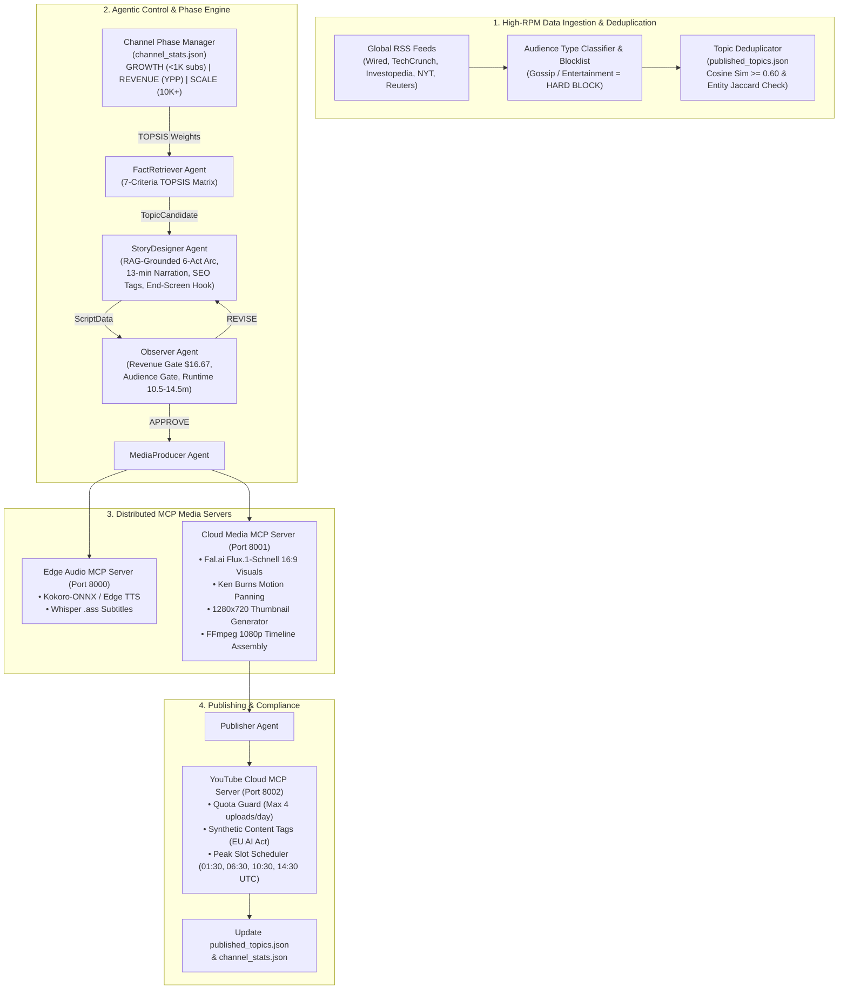

# Autonomous YouTube Storytelling Video Generation (CSVG) Pipeline

Production-grade, zero-human-intervention **Customized Storytelling Video Generation (CSVG)** pipeline powered by an **8-Stage Mathematical, ML & Graph-RAG Architecture**. Built for high-retention 11–14 minute 16:9 widescreen Infotainment channels targeting **$2,000+ USD / Month** ad revenue at 4 videos per day.

---

## 🏛️ Master System Architecture Diagram



---

## 💰 API & Resource Cost Breakdown (Free vs. Paid)

| Resource / API | Role in Pipeline | Cost Model | Details & Quota Limits |
| :--- | :--- | :--- | :--- |
| **Global RSS Feeds** | News ingestion (TechCrunch, NYT, Wired, Reuters, Investopedia) | 🟢 **100% FREE** | Direct XML feeds; no API keys required |
| **World Bank Open Data API** | Macro-economic indicators (GDP, Inflation) | 🟢 **100% FREE** | Open public API; unlimited requests |
| **NASA APOD API** | Space & telemetry fact enrichment | 🟢 **100% FREE** | Public key (`DEMO_KEY` or free registered key) |
| **Wikipedia & History APIs** | Historical archive fact verification | 🟢 **100% FREE** | Public Wikipedia REST API |
| **YouTube Data API v3** | Channel Analytics & Video Uploads | 🟢 **100% FREE** | Free daily quota of 10,000 units (4 uploads = ~6,400 units) |
| **Kokoro-ONNX TTS** | Neural speech audio synthesis (82M weights) | 🟢 **100% FREE** | Runs locally on CPU / Pi 5; zero API cost |
| **Faster-Whisper** | Subtitle timestamp alignment (`.ass` generator) | 🟢 **100% FREE** | Runs locally on CPU / Pi 5; zero API cost |
| **FFmpeg Engine** | Video zooming, motion panning & 1080p timeline assembly | 🟢 **100% FREE** | Open-source system binary |
| **OpenRouter / LLM API** | Script generation & GraphRAG synthesis | 🟡 **PAID / LOW COST** | ~**$0.002–$0.008** per script via Claude 3.5 / Gemini / DeepSeek |
| **Fal.ai (Flux.1 Schnell)** | 16:9 widescreen cinematic visual generation | 🟡 **PAID** | ~**$0.003** per image ($\approx$ **$0.045** for 15-shot video) |
| **Replicate API** | Fallback image generation if Fal.ai is unavailable | 🟡 **PAID (Fallback)** | ~**$0.005** per image |
| **Marketaux / API Ninjas** | Supplemental financial news facts | ⚪ **OPTIONAL FREE TIER** | Optional; fallback data included |

> **Total Cost to Produce 1 Video:** $\approx$ **$0.05 USD** (15 Flux.1 images + LLM tokens).  
> **Estimated Ad Revenue per Video:** **$16.67+ USD** at $13.00 blended RPM ($300+ revenue yield per 100K views).

---

## 🛠️ System Tooling & Dependencies

### 1. Operating System Binaries (System Level)

| Binary / Tool | Minimum Version | Installation Command | Purpose |
| :--- | :--- | :--- | :--- |
| **Python** | 3.9+ | Default system Python | Core runtime |
| **FFmpeg** | 4.4+ | `sudo apt install ffmpeg` *(Linux)* / `brew install ffmpeg` *(macOS)* | Video encoding, Ken Burns pan & zoom, 1080p assembly |
| **Git** | 2.30+ | `sudo apt install git` | Source control |

### 2. Python Environment Dependencies (`requirements.txt`)

```ini
# Core Framework & Data Models
pydantic>=2.0.0
pydantic-settings>=2.0.0
feedparser>=6.0.10
numpy>=1.24.0
python-dotenv>=1.0.0

# HTTP & Web Servers
requests>=2.31.0
aiohttp>=3.9.0
fastapi>=0.100.0
uvicorn>=0.22.0

# Math & Data Visualization
matplotlib>=3.7.0
opencv-python-headless>=4.8.0

# YouTube Publishing & APIs
google-api-python-client>=2.100.0
google-auth-oauthlib>=1.1.0
google-auth-httplib2>=0.1.1
fal-client>=0.5.0

# Media Production Extensions
Pillow>=10.0.0              # Thumbnail & graphics rendering
kokoro-onnx>=0.19.0        # Local neural TTS synthesis (Optional - falls back to Edge TTS)
faster-whisper>=0.10.0      # Local subtitle alignment (Optional - falls back to Edge Whisper)
```

---

## 📈 Monetization Engine & Daily Publishing Strategy

### Audience-Type Routing & RPM Tiers

The system skips low-CPM entertainment/gossip feeds and routes exclusively to high-RPM global categories:

| Slot | Target Niche | RPM Ceiling | Upload Time (IST) | Target Audience |
| :--- | :--- | :---: | :---: | :--- |
| **V1** | Personal Finance & Investing | **$10–$25** | 07:00 IST | US night / UK & EU morning |
| **V2** | Technology & Artificial Intelligence | **$10–$22** | 12:00 IST | US East morning |
| **V3** | Business & Entrepreneurship | **$8–$20** | 16:00 IST | US West morning |
| **V4** | Health & Future Science | **$8–$18** | 20:00 IST | US Primetime |

### Revenue Calculation Formula

$$\text{Revenue} = \text{Views} \times \left( \frac{\text{RPM}}{1000} \right) \times \text{MidRollMultiplier}$$

* **Target Runtime:** 11–14 minutes (15 shots, $\approx 1,950$ words narration).
* **Mid-Roll Multiplier:** **2.6x** (3 mid-roll ad placements unlocked).
* **Break-Even Point:** Just **493 views per video** at $13.00 blended RPM to achieve $2,000 USD/month across 120 videos.

---

## 🚀 Architectural Upgrades (New)
 
The pipeline has been upgraded with the following production-grade features:

### 1. Dynamic NLP RAG Expansion
* **Semantic Search Grounding**: Replaced static boilerplate filler text with a dynamic `scikit-learn` `TfidfVectorizer` and `cosine_similarity` search engine. Short script segments are expanded with the most semantically relevant real-time facts fetched from search results.
* **Diverse Citations**: Instructed the LLM to attribute facts dynamically to their actual source publications (e.g. Wikipedia, New York Times, Wired) instead of generic over-attributions.

### 2. Specialized Visuals Audio Merging & Watermarking
* **FFmpeg Audio Mixing**: Specialized visual clips (memes, SVG tickers, matplotlib charts) are automatically merged post-generation with the corresponding voiceover WAV track to prevent audio drops.
* **Animated Tickers**: Refactored stock tickers to use regex word-boundary triggers to avoid accidental matches.
* **OpenCV Outro Overlay**: Generates a professional dark semi-transparent banner overlay on the final outro shot containing a creative subscribe and comment prompt.

### 3. Subtitle Alignment & Numeric Normalization
* **Typo-Free Whisper Alignments**: Integrated `difflib.SequenceMatcher` to realign Whisper transcriptions back to the original script spelling.
* **Large Number Expansion**: Sanitizes numbers (e.g. `5000000` -> `5 million`) and currencies (e.g. `$100` -> `100 dollars`) inside FastAPI to prevent Kokoro TTS reading glitches.

### 4. Widescreen Hybrid AI Thumbnail Generator
* **AI Backgrounds**: Generates high-CTR custom widescreen background thumbnails using `fal.ai` (`flux/schnell`) or `replicate`, falling back to clean dark themes if both are down.
* **Multiline Word Wrapping**: Word-wraps long video titles across up to 2 lines cleanly on the thumbnail canvas.
* **Auto-Upload**: Integrated the YouTube Data API `thumbnails().set` endpoint to automatically publish the custom thumbnail image to YouTube post-upload.

### 5. Federated RAG & Hallucination Defense
* **Federated Multi-Engine Ingestion:** Integrates DuckDuckGo, NewsAPI, and Wikipedia into a unified search query planner.
* **Anti-Slop Content Sanitizer:** Employs regex filters to eliminate promotional terms, advertising junk, and repetitive generic AI phrases from RAG context.
* **TrumorGPT Auditor:** Fact-checks and scores raw claims before feeding them into the story generation engine to mitigate hallucinations.

### 6. Multi-Stage Quality Gates & Verification
To ensure premium channel status and protect against YouTube demonetization, the system runs 8 automated validation checks before and after publishing:
* **Gate 1 (Topic-to-Script Coherence):** Uses TF-IDF cosine similarity to ensure script stays strictly on-topic, validating a target word count of $\ge 1,500$ words.
* **Gate 2 (Script-to-TTS):** Checks wav files for completeness, duration, and empty speech.
* **Gate 3 & 3b (Subtitle Alignment):** Verifies subtitle coverage across the entire video timeline and checks subtitle-to-script text alignment coherence.
* **Gate 4 (Master Video Integrity):** Verifies resolution, frames, and video-audio stream alignment.
* **Gate 5 (YouTube AI Disclosure Auto-Tagging):** Scans for photorealistic or synthetic humans, automatic voice, and realistic simulations, auto-tagging YouTube metadata with `syntheticContent` & `bInformed` compliant with 2025/2026 YouTube guidelines.
* **Gate 6 (Anti-Slop Script Entropy Audit):** Measures Shannon Word Entropy, unique word ratio, sentence length variance, and minimum narration depth to prevent repetitive AI patterns.
* **Stage 8 (Per-Shot Quality):** Audits visual fluidity using Frechet Video Distance (FVD) and optical flow metrics.

---

## ⚙️ Installation & Deployment

### 1. Local Setup

```bash
# Clone repository
git clone https://github.com/jeevanjoshi/buzzdropfeedv2.git
cd buzzdropfeedv2

# Create virtual environment & install dependencies
python3 -m venv venv
source venv/bin/activate
pip install -r requirements.txt

# Configure environment variables
cp .env.example .env
# Edit .env and fill in FAL_KEY, YOUTUBE_API_KEY, etc.
```

### 2. Running the Autonomous Pipeline

You can run the pipeline directly or via the production wrapper which logs output to both standard output and files.

```bash
# Run via production wrapper (Recommended, logs output to logs/pipeline_run.log)
./run_production.sh

# Run manually
python3 main.py --global

# Offline Dry-Run Mode (Uses local synthetic media generators for zero-cost testing)
python3 main.py --offline

# Run full automated test suite
python3 run_tests.py
```

### 3. YouTube Video Quality & Sync Auditor
You can audit already uploaded videos or generated videos for subtitle sync, speech drift, coherence, and relevance using the verifier script:

```bash
# Run post-production audit on a video
python3 run_video_verifier.py <YOUTUBE_VIDEO_ID_OR_URL>
```

This retrieves standard/auto-generated transcripts, analyzes Whisper/subtitle timings, and generates a markdown report detailing any synchronization drifts, semantic coherence scores, and actionable fixes.

### 4. Raspberry Pi 5 / Server Automation (4 Runs / Day)

Add the following to your crontab (`crontab -e`) to execute the 4 daily publishing slots automatically:

```cron
# CSVG Autonomous Publishing Schedule (UTC) using production wrapper
30 1 * * * cd /opt/buzzdropfeedv2 && ./run_production.sh >> /opt/buzzdropfeedv2/logs/cron_system.log 2>&1
30 6 * * * cd /opt/buzzdropfeedv2 && ./run_production.sh >> /opt/buzzdropfeedv2/logs/cron_system.log 2>&1
30 10 * * * cd /opt/buzzdropfeedv2 && ./run_production.sh >> /opt/buzzdropfeedv2/logs/cron_system.log 2>&1
30 14 * * * cd /opt/buzzdropfeedv2 && ./run_production.sh >> /opt/buzzdropfeedv2/logs/cron_system.log 2>&1
```

---

## ⚖️ EU AI Act & YouTube Policy Compliance

* **Synthetic Disclosure Tags:** `syntheticContent: true` and `bInformed: true` are injected automatically into YouTube upload metadata when mandatory AI-generated triggers (such as photorealistic visual components or synthetic voices) are detected by **Gate 5**.
* **Copyright Safety:** 100% freshly rendered AI visuals (Flux.1) + royalty-free CC0 ambient audio ensure zero copyright flags.
* **Quota Guard:** Publisher checks API limits before uploading (max 4 uploads/day = 6,400 / 10,000 daily API units).

